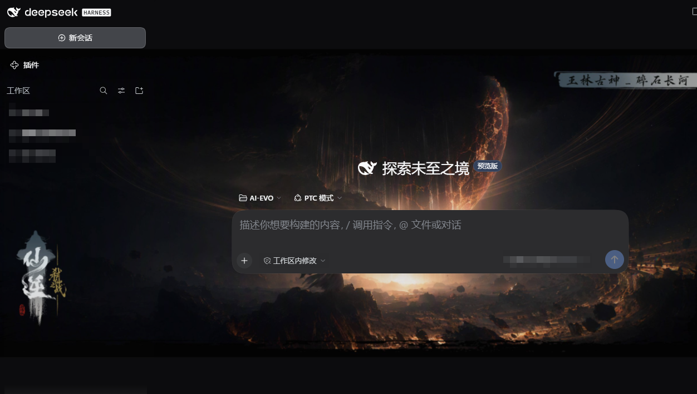
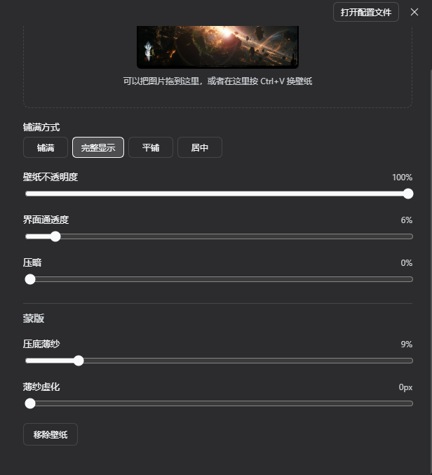

# DSH 自定义壁纸插件（DSH Custom Wallpaper）

[](https://dsh-plugin.org/plugins/Ansellwan/DSH-Custom-Wallpaper)
[](https://www.npmjs.com/package/dsh-ui-wallpaper)
[](https://www.npmjs.com/package/dsh-ui-wallpaper)
[](LICENSE)

> 一句话价值：装上它，你的 DeepSeek Harness 桌面版界面立刻拥有自定义壁纸——本机任意图片做背景，透明度、模糊、界面通透度实时可调，即时预览。

A DeepSeek Harness (DSH) community plugin that lets you set any local image as the app wallpaper, with real-time controls for opacity, blur, surface translucency and dimming.



| 设置面板 | 说明 |
|---|---|
|  | 壁纸页内置在「设置」中：拖入 / 粘贴 / 选择本机图片，滑杆实时调节 |

- **能力分类**：界面与外观（UI / Appearance · 主题与壁纸）
- **许可证**：MIT
- **运行形态**：DSH Web 客户端插件（profile：`desktop`）
- **安装包名**：`dsh-ui-wallpaper`（npm 包 · 插件行 id：`ui-wallpaper`）

## 安装（复制即用）

要求：DeepSeek Harness 桌面版，CLI ≥ 11.7（内置 Node ≥ 18）。

```powershell
# 方式一：从 npm 安装（推荐）
dsh plugin --profile desktop add dsh-ui-wallpaper

# 方式二：从 GitHub 仓库直装（无需 npm，github: 简写）
dsh plugin --profile desktop add github:Ansellwan/DSH-Custom-Wallpaper

# 方式三：完整 git 地址同样可行
dsh plugin --profile desktop add https://github.com/Ansellwan/DSH-Custom-Wallpaper.git
```

> `--profile` 后写你想装进哪个 profile（桌面软件用 `desktop`）；名字不存在会自动创建。

安装完成后 **重启 DSH 应用** 即可生效（客户端脚本随页面加载自动注入）。如果你是在浏览器里使用 DSH Web 界面，刷新页面（Ctrl+R / F5）同样可以。

卸载：

```powershell
dsh plugin --profile desktop remove dsh-ui-wallpaper
```

> 也可以在 DSH 的 设置 → 插件 面板中直接卸载。

升级到新版本（注意：`add` 对已安装的包不会自动升版，要显式带上版本号）：

```powershell
dsh plugin --profile desktop add dsh-ui-wallpaper@<新版本号>
```

## 怎么用

1. 打开左下角 **设置**，导航里点 **壁纸**
2. 点「选择图片」挑一张本机图片；也可以把图片**拖进面板**，或在壁纸页内按 **Ctrl+V**、点「读剪贴板」
3. 拖动滑杆微调，面板背后即时预览

| 控件 | 作用 | 建议 |
|---|---|---|
| 铺满方式 | 铺满 / 完整显示 / 平铺 / 居中 | 大图用「铺满」 |
| 壁纸不透明度 | 壁纸自身的浓淡 | 60–100% |
| 界面通透度 | 界面底色让出多少给壁纸，**决定壁纸是否看得见** | 0–30%，越大壁纸越明显、文字对比越低 |
| 模糊 | 壁纸整体虚化 | 0–12px |
| 压暗 | 压暗壁纸，深色主题下更耐看 | 0–20% |
| 压底薄纱 | 壁纸与界面之间的深色半透明底（提对比度下限） | 15–30% |
| 薄纱虚化 | 薄纱背后的 backdrop 虚化，负责抹掉细节 | 8–16px |
| 壁纸饱和 | 壁纸色彩浓度 | 80–100% |

> **粘贴只在壁纸页内生效**：只有焦点位于壁纸设置面板时，Ctrl+V 才被壁纸接管，不会影响你在对话框、编辑器等处的正常粘贴（早期版本的全局粘贴监听事故已修复，详见下文「粘贴闸门」）。

壁纸设置保存在**本机浏览器存储**（`localStorage`，键 `dsh.ui-wallpaper/v1`），不写入 DSH 配置，不随账号同步。大图入库前会自动用 canvas 压到长边 2560px、必要时转 JPEG，避免撑爆存储配额。

## 权限与隐私（风险声明）

- **纯本地运行**：无任何外部服务、无网络请求，不上传任何数据
- **存储**：仅写入本机 `localStorage`（壁纸参数与图片数据）
- **剪贴板**：安装了捕获阶段 `paste` 监听与 `navigator.clipboard.read()`，但**仅在焦点位于壁纸设置面板内**时才接管（焦点判据见源码 `client.js` 的粘贴闸门），其余场景完全不干预
- **DOM 注入**：插件会插入一个 `z-index: -1` 的固定背景层，并将壳层容器（侧栏 / 中栏底色）改为半透明以露出壁纸；对话气泡、代码块、输入框等面板**刻意保持不透**，保证文字对比度

## 兼容性

| 项目 | 说明 |
|---|---|
| DSH 版本 | 桌面版 Web 客户端，CLI 11.7.0 实测通过 |
| Profile | `desktop` |
| Node | ≥ 18（由 DSH 内置运行时满足） |
| 主题 | 浅色 / 深色自动跟随（样式全部使用主题 token `--dsw-alias-*`） |

⚠️ **已知限制**：DSH 大版本更新后，壁纸有可能突然不显示（界面结构变化，插件需要跟着适配）。遇到这种情况请[提 Issue](https://github.com/Ansellwan/DSH-Custom-Wallpaper/issues) 告知，会尽快适配；技术原因见下方「本地开发」一节。

## 设计依据（为什么默认值是这样）

对实际使用壁纸的实测（亮度 / 饱和度 / 对比度）得出三条结论：

1. **纯深色薄纱有天花板**：能救浅色文字，救不了深色文字
2. **模糊比压暗有效**：最差区域对比度从 1.00:1 抬到 2.10:1，中位从 3.34:1 抬到 5.03:1
3. **深色字与浅色字无法在同一张图上同时安全**：选图要跟主题同向（深色主题配暗图）

默认值「薄纱 18% + 薄纱虚化 10px」= 薄纱托住下限、虚化抹平细节，缺一都治不了"花"。

## 文件结构

| 文件 | 作用 |
|---|---|
| `package.json` | bundle 清单：`dsh.bundle.patch` + `dsh.client`（platform/immediately/inject） |
| `cordis.patch.yml` | 插入插件行 `id: ui-wallpaper` |
| `index.js` | Host 半：空实现（壁纸纯浏览器侧，无 Host 状态） |
| `client.js` | 浏览器半：背景层 + 设置页 + 存储 |
| `locale/zh.json`、`locale/en.json` | 插件列表的标题与描述（中英双语） |
| `icon.svg` | 插件列表图标 |
| `tools/` | 自检与回归测试脚本 |
| `docs/` | 截图 |

## 本地开发与回归测试

```powershell
node tools/check-plugin.mjs .
node tools/smoke-client.mjs client.js
```

回归测试会模拟一个迷你浏览器环境，把真实的 `client.js` 完整跑一遍，自动检查几十项关键行为：壁纸能否正常显示、各滑杆参数是否生效、快捷键粘贴会不会误伤其他页面、卸载后能否清理干净等。结尾输出 `ALL CHECKS PASSED` 即为全部通过。

### 开发要点（改代码前先看）

- 客户端入口是 `window.__ModuleLoader__.load({ id, factory })`，**id 必须等于包名** `dsh-ui-wallpaper`；`factory(require)` 里**只能 require `react`**（官方警告：抛错的组件会让整个插槽条目空白）
- 设置页注册在 `settings.section`（整页插槽），组件只拿 `close` 一个 owner prop
- 「界面通透度」的值写在**根元素内联样式**（`--wlp-surface`）；任何中间层都不许声明该变量（子元素声明会压过祖先继承值，导致滑杆失灵），兜底只能写在读取侧 `var(--wlp-surface, 34%)`
- 选择器只匹配类名**后缀**（`[class*="_frame"]`），宿主改版时先核对这些后缀

## 许可证

[MIT](LICENSE) © 2026 Ansellwan
